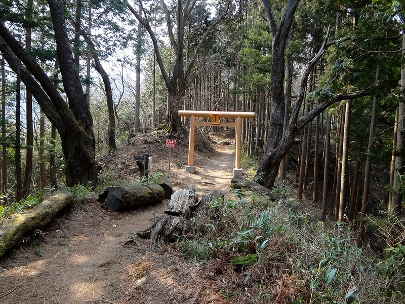
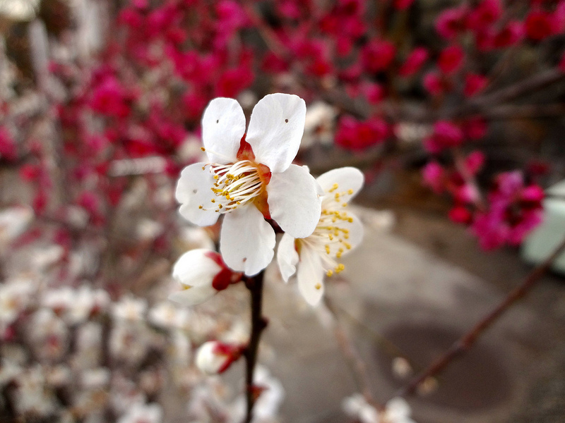

## Access ##

From Shinjuku, take the JR Chuo line going towards Okutama. 

## Course ##

From Kori station go South (there's a 7-11 on the way), follow signs pointing to Ootsukayama. 

There's a nice lunch place between Ootsukayama and Mitake. Alternatively, you can stop for lunch at the top station of the Mitake cable car, enjoy the viewpoint there.

On top of Mitake, be sure to visit Mitake Shrine and note the ancient tree.

Follow signs to Hinode-yama (日の出山). 

From the top of Hinode, take the path leading to Mimuro-yama.

Yoshino Baigo will be on your right. The entrance fee is ¥200, free at times. Opposite of Yoshino Baigo, there's a nice little local food place with beer. Not too expensive.

Optionally, on the way back, you can stop at Kabe onsen (Kabe station).

## When to go ##

The course is not hard and Mitake shrine is interesting in all four seasons, so any time of year is good for this hike.

